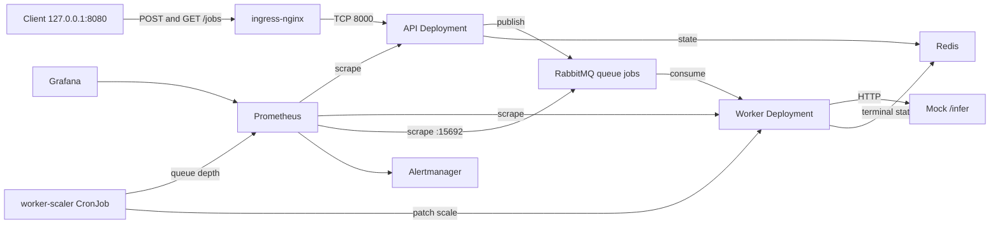

# DevOps take-home application

Start with [ASSIGNMENT.md](ASSIGNMENT.md). This starter supplies a working application;
your task is its containerization, Kubernetes deployment, and operational tooling.
Stop after four hours and describe unfinished work. An optional cloud deployment
does not earn extra credit.

## Prerequisites

- Python **3.12** (tested with 3.12.11), a container runtime with Docker Compose support,
  and Git. Docker Desktop, or an equivalent supported runtime, is sufficient.
- For your solution: a local Kubernetes distribution, kubectl, and your chosen
  deployment tooling. No cloud or AI-provider account is necessary.
- Internet access is needed initially to download dependencies and images. Running
  the application needs no internet service.
- macOS/Linux or Windows through WSL2; AMD64 and ARM64 are intended targets.
  Start with 4 CPUs and 8 GiB allocated to your runtime; this is a planning budget,
  not a measured minimum. Adjust your monitoring footprint to your laptop.

## First run (application development only)

From the extracted directory:

```sh
git init
python3.12 -m venv .venv
. .venv/bin/activate
python -m pip install --require-hashes -r requirements-dev.lock
python scripts/init_env.py
docker compose -f compose.dependencies.yaml up -d --build --wait
python -m pytest -m 'not integration' -q
RUN_INTEGRATION=1 python -m pytest -m integration -q
```

In two terminals, activate the environment, stay in this directory, and run:

```sh
python -m takehome api
```

```sh
python -m takehome worker
```

In a third terminal:

```sh
python scripts/smoke_test.py --base-url http://127.0.0.1:8000
python scripts/load_test.py --base-url http://127.0.0.1:8000 --jobs 30 --concurrency 5
```

The Compose file runs **only dependencies**. It is a quick way to establish that
the supplied code works before building your own application containers and
Kubernetes deployment. It is not an assignment solution. The mock Dockerfile is
provided; author the API and worker Dockerfiles yourself.

The programs automatically read the ignored `.env` file. `init_env.py` creates
random local passwords with restrictive file permissions and never overwrites an
existing file. Do not use the placeholder values in `.env.example`.

The development API is at port 8000; worker operations at 8001; mock at 8081;
RabbitMQ AMQP at 5672, RabbitMQ management at 15672; Redis at 6379. Compose publishes
dependency ports only on loopback. Keep these dependencies internal in Kubernetes.
Read local management credentials from your `.env`; do not include them in your submission.

## Architecture and design

The supplied application is unchanged. This repository adds containers, a local kind cluster, Kustomize workloads, Terraform for create and destroy, and a pipeline that runs the original tests. [APPLICATION.md](APPLICATION.md) is the HTTP contract, the metric names, and the delivery rules. Unit tests do not need running dependencies. Integration tests use a unique queue, start the API and worker in-process, and require the Compose dependencies in the mock's normal mode. The sections below say which of those rules this deployment implements, and which production changes are only described.

### Implemented request path

```text
Client -> Ingress /jobs -> API -> RabbitMQ -> Worker -> Mock /infer
                            |                   |
                            +----> Redis <------+
```



A client on the laptop reaches only `http://127.0.0.1:8080/jobs`. kind maps host port 8080 to the node port 80, where the ingress-nginx controller listens. The Ingress admits the prefix `/jobs` and sends it to the `api` Service on port 8000. `/livez`, `/readyz`, `/metrics`, OpenAPI, the broker, Redis, the mock, and the worker have no Ingress rule. Checks on 24 Sep 2026 returned nginx 404 for those operational paths.

`POST /jobs` validates the prompt, writes the initial `queued` record in Redis, and publishes a persistent message to the durable queue `jobs` with publisher confirms. The API returns 202 and `job_id` only after both of those succeed. `GET /jobs/{job_id}` reads Redis. It does not call the worker.

The worker prefetches one message. It marks the job `running`, calls `http://mock:8081/infer`, and writes `succeeded` or `failed` before it acknowledges. A redelivered message whose Redis record is already terminal is acknowledged without calling the mock again. Transport errors, HTTP 429, and 5xx are retried up to `EXTERNAL_MAX_ATTEMPTS` (3). The mock process stays ready when `/infer` returns 503, which is how a dependency failure is distinguished from a dead mock.

Cluster DNS resolves `api`, `worker`, `rabbitmq`, `redis`, `mock`, `prometheus`, `grafana`, and `alertmanager` inside the `takehome` namespace. API and worker pods set `enableServiceLinks: false` so Kubernetes does not inject service environment variables beside the `APP_*` port names. The scaler keeps service links off as well and uses its own ServiceAccount to call the API server.

### Implemented workloads

| Workload | Form | Count | Reachable as | State |
|---|---|---|---|---|
| API | Deployment, rolling update, `maxUnavailable: 0`, `maxSurge: 1` | 2 | Ingress `/jobs` and ClusterIP `:8000` | Stateless |
| Worker | Deployment; CronJob adjusts the scale subresource | 1, up to 3 | ClusterIP `:8001` for metrics | Stateless |
| Mock | Deployment | 1 | ClusterIP `:8081`, worker only | Stateless stand-in for an external API |
| RabbitMQ 4.1.4 | Deployment, `Recreate`, hostname `rabbitmq` | 1 | ClusterIP 5672, management 15672, metrics 15692 | hostPath, node name `rabbit@rabbitmq` |
| Redis 7.4.5 | Deployment, `Recreate`, AOF | 1 | ClusterIP `:6379` | hostPath |
| Prometheus | Deployment | 1 | ClusterIP `:9090` | emptyDir |
| Grafana | Deployment, anonymous Viewer | 1 | ClusterIP `:3000`, port-forward only | provisioned from a ConfigMap |
| Alertmanager | Deployment | 1 | ClusterIP `:9093` | emptyDir, no external receiver |
| worker-scaler | CronJob, every minute, `Forbid` | one job at a time | no Service | reads Prometheus, patches `deployments/worker/scale` |

API and worker containers are `python:3.12.11-slim-bookworm`, installed with `pip --require-hashes`, and run as uid 10001 with a read-only root and an emptyDir at `/tmp`. Requests are 50m CPU and 128Mi; limits are 500m and 256Mi. Startup probes hit `/livez`, so a slow broker does not get the process killed. Readiness is `/readyz` (broker channel and Redis). Liveness is `/livez` and ignores a remote outage. `terminationGracePeriodSeconds` is 30, above the 20-second worker drain. On SIGTERM the worker stops taking new jobs and lets the active job finish. What it does not finish is redelivered.

Non-secret settings live in the `app-config` ConfigMap: queue name, mock URL, timeouts, prefetch 1, and a 24-hour result TTL. `RABBITMQ_URL` and `REDIS_URL` come from the `app-credentials` Secret. Terraform generates those passwords when the Secret is absent and leaves an existing Secret alone, so a later apply does not rotate credentials under running pods. The Secret is not in git. `secret.example.yaml` lists the key names.

### Implemented controls

**Networking.** `deploy/kustomize/networkpolicy.yaml` is default-deny, then explicit allows. ingress-nginx and Prometheus may reach the API on 8000. The API and worker may reach RabbitMQ on 5672 and Redis on 6379. The worker may reach the mock on 8081. Prometheus may scrape the worker on 8001 and RabbitMQ on 15692. Grafana may reach Prometheus. The scaler may reach Prometheus. DNS egress to `kube-system` is allowed. kindnet enforces these policies after a short delay. It matches API-server traffic after DNAT, so Prometheus and the scaler are allowed TCP 6443 as well as 443. `scripts/check-network.sh` shows a pod outside the allow list timing out to Redis while the API still connects.

**Scaling.** The API stays at 2 replicas so one pod can roll without taking `/jobs` down. The worker manifest baseline is 1. The CronJob sets 1 replica when queue depth is below 2, 2 replicas at depth 2 or 3, and 3 at depth 4 or more. It never scales to zero. `kubectl apply` writes the baseline of 1 back; the next minute corrects it. The scaler's Role can patch only the `worker` scale subresource. `scripts/resilience.sh` also shows a manual scale to 2 with jobs still completing.

**Observability.** Prometheus scrapes annotated API and worker pods and the RabbitMQ Prometheus plugin. Per-queue series are on (`prometheus.return_per_object_metrics`). Grafana's Takehome jobs dashboard shows API rate, 5xx ratio, handler-latency p95, worker completions, consumer connection, jobs in progress, queue depth, and firing-alert count. Four rules feed an in-cluster Alertmanager with an empty receiver: no consumers, worker consumer disconnected, API error ratio, and queue depth above 10. CPU, memory, and logs stay in `scripts/observe.sh` (`kubectl top` and `kubectl logs`). Handler latency is not end-to-end job latency. Counters reset when a process restarts; the dashboard uses `rate`.

**Delivery and releases.** Images are tagged with the 12-character git SHA in CI, and with `:local` (mock `:1.0.0`) for a laptop apply. A rollout that does not become ready fails `scripts/deploy.sh` and the pipeline. `scripts/rollback.sh` points the API at a missing tag, watches the rollout time out, and undoes it. `scripts/dependency-failure.sh` sets `MOCK_MODE=unavailable` and expects `external_unavailable` while mock `/livez` stays ready.

**Reproducibility.** `deploy/kind/cluster.yaml` is the one-node kind cluster. `deploy/kustomize` is the namespace. `deploy/terraform` creates the cluster when it is missing, installs ingress-nginx, loads images, applies Kustomize, and waits for rollouts. Destroy deletes the cluster and the Compose volumes. `scripts/cluster-up.sh`, `scripts/deploy.sh`, and `scripts/cleanup.sh` call that Terraform. `Jenkinsfile` is the pipeline definition. `.github/workflows/ci.yml` runs the same `scripts/ci-local.sh` on GitHub-hosted runners and is the CI that has actually run.

**Persistence that is implemented.** Redis AOF and the RabbitMQ data directory sit on hostPath volumes on the kind node. `scripts/persistence.sh` deleted each pod and read the marker back. The fixed RabbitMQ node name keeps the mnesia directory usable after the pod name changes. Deleting the kind node deletes that disk.

### Decisions

kind is the local cluster because the assignment accepts it and no cloud account is required. Kustomize holds the manifests so CI and Terraform apply one tree. Terraform shells out to kind 0.33 instead of a kind provider, because the provider pins an older kind and cannot adopt the cluster that is already running. One node is a laptop budget: Redis and RabbitMQ are single-replica `Recreate` Deployments, not a replicated pair.

Queue depth drives worker replicas because the worker is bound by the mock call, one message at a time. A CPU autoscaler would not see that backlog. The scaler is a CronJob using the API image's Python, not a second controller, so the laptop does not run a metrics adapter. Depth is the signal this RabbitMQ image actually exports. Queue age is not available from it.

The push stage publishes the immutable tag to a local registry on `127.0.0.1:5001` when `DOCKER_REGISTRY` is unset. Deploy still loads the image into the kind node. The node is not a registry mirror. A Jenkins agent with a real registry sets `DOCKER_REGISTRY` and uses credential id `docker-registry`.

### Discussion

The assignment lists these as discussion topics. Queue-driven worker scaling, NetworkPolicy enforcement, pod-level persistence, and API rollback are implemented and were exercised. API HPA, internet egress, production TLS and identity, a highly available broker and Redis, and off-node backup are discussed here and are not deployed. Nothing below assumes a cloud account.

#### API HPA

**Proposed.** The API Deployment stays at 2 replicas with `maxUnavailable: 0` and `maxSurge: 1`. That is enough for a rolling update to keep `/jobs` serving on a laptop, and it does not require metrics-server to be healthy before the API can run. `scripts/observe.sh` can install metrics-server for `kubectl top`, which would be enough to feed a CPU HorizontalPodAutoscaler. A CPU target would still be the wrong signal. The API validates a small JSON body, writes Redis, and waits for a publisher confirm. A local run showed the API pods under 50Mi, and the work is waiting on the broker and Redis. CPU would sit near the request and the autoscaler would stay at its minimum while accept latency grew.

If traffic warranted autoscaling, the metric would be request rate or in-flight accepts from `api_http_requests_total`, with a minimum of 2 so a rollout can still surge. The worker must not share that autoscaler. Its concurrency is one message per replica, and the backlog lives in RabbitMQ.

#### Queue-driven worker scaling

**Implemented.** `deploy/kustomize/scaler.yaml` runs every minute. It queries `rabbitmq_queue_messages{queue="jobs"}` and patches only the `worker` scale subresource. Depth below 2 keeps 1 replica, depth 2 or 3 sets 2, and depth 4 or more sets 3. The floor is 1, so the queue is not left without a consumer. `scripts/scale-from-queue.sh` queued 4 jobs with the worker stopped, the scaler moved the Deployment to 3 replicas, and after the queue drained it returned to 1. The smoke test then passed (`f094d44c-0373-4687-9873-97c00c8a3b76`). `scripts/resilience.sh` also scaled the worker to 2 by hand and jobs still completed.

The choice of a CronJob, rather than KEDA or a custom-metrics HPA, is the laptop constraint: the API image already has Python, and Prometheus already has the queue series. A second controller would not change the decision. The costs are real. The reaction time is about a minute, plus the mock's processing time. `kubectl apply` writes the manifest baseline of 1 back, and the next run corrects it. This RabbitMQ image exports depth and consumer count once per-object metrics are enabled. It does not export queue age, so an old message sitting behind one slow job looks the same as a short queue. A later scaler should add age and keep the floor at one replica. Prefetch stays 1, so replica count is the parallelism.

#### Enforced NetworkPolicies

**Implemented, and checked.** `deploy/kustomize/networkpolicy.yaml` is default-deny for ingress and egress, then explicit allows: ingress-nginx and Prometheus to the API, the API and worker to RabbitMQ and Redis, the worker to the mock, Prometheus to the metrics ports, Grafana and the scaler to Prometheus, and DNS to `kube-system`. kindnet is the CNI on this cluster, and it does enforce the policies after a short delay. `scripts/check-network.sh` waits, then starts a pod labeled `netcheck`. That pod timed out connecting to Redis. The API, which is allowed, still connected. Kubelet probes are node traffic, and the smoke test still passes through ingress. Creating the policy objects is not the proof. The denied connection is.

kindnet matches API-server traffic after DNAT. The Service is port 443 and the endpoint is port 6443, so a policy that allows only 443 does not let Prometheus or the scaler reach the API server. Both policies allow 6443 as well. A brand-new pod can connect for a moment before kindnet programs the rules, which is why the check sleeps before it tries.

On a production CNI the same default-deny shape applies. The difference is operational: name the CNI, fail a deploy when the enforcement check fails, and treat the API-server allow as a narrow port and namespace rule rather than a blanket cluster egress.

#### External egress

**Proposed for a real provider. The local mock does not need it.** `EXTERNAL_SERVICE_URL` is `http://mock:8081/infer`. The mock is a ClusterIP Service in `takehome`. The worker NetworkPolicy allows that port and DNS, and it does not allow general internet egress. Internet access is not required to run the exercise.

A real inference API would be a hostname outside the cluster. The worker policy would allow egress only to that destination, or to an in-cluster proxy that holds the allow-list, and DNS would stay limited to `kube-system`. An `ExternalName` Service would not replace that rule, because the packet still has to be permitted after DNS resolves. Delivery is at least once, so the outbound call would carry a provider idempotency key. Transport errors, HTTP 429, and 5xx would keep the existing cap of 3 attempts. The mock's `/livez` staying ready while `/infer` returns 503 is the pattern for "the dependency is up and refusing work," and that check would move to the provider's health signal without failing the worker liveness probe.

#### Production identity and TLS

**Proposed.** The running API is HTTP on loopback, with `ssl-redirect` false and no authentication, so the supplied smoke test can call `POST /jobs`. That is acceptable for this exercise and is not a public deployment. RabbitMQ and Redis passwords are random, stored in the `app-credentials` Secret, and generated by Terraform only when the Secret is absent. They also sit in local `terraform.tfstate`, which is gitignored. Application containers run as uid 10001 with a read-only root. That is process hardening, not caller identity.

Production would terminate TLS at the ingress, present a certificate from the platform or cert-manager, and authenticate callers before the request reaches the API. Source ranges would limit who can open `/jobs`. Workload identity would replace long-lived cloud keys if the worker ever called a cloud API. The broker and Redis passwords would come from a secret store that can rotate them, with a planned restart, rather than living in a laptop state file. The application would still receive them as `RABBITMQ_URL` and `REDIS_URL`. Those URLs are not logged.

#### Highly available RabbitMQ and Redis

**Proposed.** Both are single-replica Deployments with `strategy: Recreate` on one kind node. Two pods cannot share the hostPath data directory, and this cluster has nowhere else to place a second replica. The client already reconnects (`RECONNECT_DELAY_SECONDS`) and readiness fails closed when Redis or the broker channel is down, so a restarted pod comes back without the API claiming it is ready. A node loss takes both data sets with it.

A highly available layout needs at least three nodes for a RabbitMQ quorum queue, pod anti-affinity so the members do not land together, and a PodDisruptionBudget once there is more than one pod. Redis would be a replica set with a sentinel or a managed primary, and the API and worker would follow the current primary. Classic mirrored queues are the wrong target on current RabbitMQ. The queue would be declared quorum, and the worker's ack-after-Redis-write behavior would stay, because a replica does not make the Redis write and the ack one transaction. A successful Redis reply in this deployment is not a failover claim.

#### Persistence

**Implemented for a pod restart.** Redis runs with `--appendonly yes` on a hostPath volume. The default `appendfsync` is every second, so a crash can drop the last second of writes. RabbitMQ keeps its data directory on a hostPath volume and uses the stable node name `rabbit@rabbitmq`, so the mnesia directory still matches after the pod name changes. Messages are persistent and the queue is durable. `scripts/persistence.sh` deleted each pod and read the same marker back.

That is pod-delete persistence on one disk. It is not replication, and it is not a guarantee that the Redis reply waited for disk. Publish and the Redis write are still separate, so a crash between them can leave an orphan `queued` record or repeat the mock call. Terminal records expire after `RESULT_TTL_SECONDS` (86400). An expired record makes a later redelivery look new.

#### Backups and recovery

**Proposed.** There is no copy of the data off the kind node. `terraform destroy` and `scripts/cleanup.sh` delete the cluster on purpose, and the hostPath goes with it. A backup would be an AOF or RDB copy taken off the node, plus enough RabbitMQ state to restore the durable queue, stored outside the cluster and encrypted because the payloads include prompts. The honest recovery path for in-flight work is an outbox that can republish, because copying a live mnesia directory from a running node is a poor restore. A recovery drill would restore into an empty cluster, start one worker, and run `scripts/smoke_test.py`. Until that drill exists, the recovery procedure is to recreate the environment and accept that queued jobs on that disk are gone.

#### Rollback

**Implemented for the API image.** `scripts/rollback.sh` sets `devops-takehome-api:does-not-exist`, requires `kubectl rollout status` to fail, runs `kubectl rollout undo`, checks that the image is the previous one, and runs the smoke test (`4ba7ce77-bc60-4c39-9769-460e5a74a8f5`). `maxUnavailable: 0` keeps the previous pods serving during the bad rollout. The same failed rollout fails `scripts/deploy.sh` and the pipeline, so a bad deploy stops before smoke. CI tags images with the 12-character git SHA, which is the revision to roll back to.

`kubectl rollout undo` restores the pod template and does not rewrite `last-applied-configuration`. A later `kubectl apply -k` is what puts the manifest and the live object back in agreement. Undo is the right emergency control for a bad image. The source of truth for a planned rollback is deploying the previous SHA through the same pipeline. A ConfigMap edit is a different failure: the Deployment revision may be unchanged while every new pod sees the new env. Rolling back that change means applying the previous Kustomize tree, then restarting the pods that already loaded it.

#### Cloud shape, not deployed

The same Kustomize tree would run on a managed cluster or a small VM cluster. HostPath would be replaced by a volume that can move between nodes, or by a managed Redis and a managed broker. The ingress would be the platform load balancer with TLS. CI would push the SHA tag to a registry the nodes can pull, by digest, and would drop the kind side-load. Secrets would come from the platform secret manager. NetworkPolicies would stay default-deny, and the pipeline would record which CNI enforced them. None of that is provisioned here, and this repository does not claim a cloud run.

## Mock controls

```sh
MOCK_MODE=unavailable docker compose -f compose.dependencies.yaml up -d --no-deps mock
# New jobs should reach failed after bounded retries.
MOCK_MODE=slow MOCK_DELAY_SECONDS=8 docker compose -f compose.dependencies.yaml up -d --no-deps mock
# Default HTTP timeout is 5 seconds; slower responses exercise timeouts.
MOCK_MODE=normal docker compose -f compose.dependencies.yaml up -d --no-deps mock
```

For optional prebuilt archives, download the archive matching your runtime's Linux
architecture and verify it against the provided SHA-256 manifest:

```sh
docker load -i devops-takehome-mock-v1.0.0-arm64.tar.gz
docker compose -f compose.dependencies.yaml up -d --no-build --wait
```

Use the `amd64` archive on an AMD64 runtime. Both archives load the same local tag,
`devops-takehome-mock:1.0.0`; do not load both into the same image store. You can
always build `mock/Dockerfile` from this directory instead.

## Cleanup

Stop the two Python processes with Ctrl-C. This removes local dependency containers
and their exercise data volumes:

```sh
docker compose -f compose.dependencies.yaml down -v
```

You are responsible for documenting cleanup of your own deployment. See the
submission checklist in the assignment before handing in your repository.

## CI/CD

`Jenkinsfile` is the pipeline: checkout, tests, image build, immutable git-SHA tag, push, deploy, and smoke. `.github/workflows/ci.yml` runs the same `scripts/ci-local.sh` on GitHub-hosted runners. That workflow is the executed CI for this repository. A Jenkins run was not claimed.

The script exits non-zero when unit or integration tests fail, a rollout does not become ready, or `scripts/smoke_test.py` fails. With `DOCKER_REGISTRY` unset, the push stage starts a registry on `127.0.0.1:5001` and pushes the immutable tag there. The deploy stage still loads that image into the kind node, because the node is not configured as a registry mirror. A Jenkins agent that should push to a remote registry sets `DOCKER_REGISTRY` and logs in with credential id `docker-registry`.

The agent needs Git, Python 3.12, Docker with Compose, Terraform 1.5 or newer, kind, kubectl, and network access to pull base images. It also needs a Docker socket and permission to create a local kind cluster. No cloud credentials are required.

## Operations

```text
Client :8080 -> ingress-nginx /jobs
             -> api:8000 (2 replicas) -> rabbitmq:5672 -> worker:8001 -> mock:8081/infer
                       |                        |
                       +-------- redis:6379 -----+
```

Recreate and remove the cluster with Terraform. `scripts/cluster-up.sh` and `scripts/deploy.sh` both apply it, and `scripts/cleanup.sh` destroys it. Job traffic is `http://127.0.0.1:8080/jobs`. RabbitMQ, Redis, the mock, the worker, and `/livez`, `/readyz`, and `/metrics` stay on ClusterIP. Ingress checks on 24 Sep 2026 returned nginx 404 for those operational paths and the API JSON body `{"detail":"job not found"}` for an unknown job id.

Liveness is `/livez`. Readiness is `/readyz`. Startup uses `/livez`, so a slow broker does not crash the process. `terminationGracePeriodSeconds` is 30, above the worker's 20-second drain. API and worker set `enableServiceLinks: false`. API starts at 2 replicas with `maxUnavailable: 0`. The worker starts at 1. Redis and RabbitMQ are single-replica Deployments with a hostPath volume on the kind node, and Redis keeps AOF. `scripts/persistence.sh` deleted each pod and read the same marker back. That survives a pod delete. Deleting the kind node deletes the disk. It is not a backup or a second replica. RabbitMQ uses a fixed node name, `rabbit@rabbitmq`, so the data directory is the same after the pod name changes.

### Networking and security

`deploy/kustomize/networkpolicy.yaml` is default-deny plus allows: ingress-nginx and Prometheus to the API, the API and worker to RabbitMQ and Redis, the worker to the mock, and Prometheus to the metrics ports. DNS egress to `kube-system` is included. kind's CNI is kindnet, and on this cluster it enforces the policies after a short delay. `scripts/check-network.sh` waits, then starts a pod labeled `netcheck`. That pod timed out connecting to Redis, while the API, which is allowed, still can. Kubelet probes are node traffic and the smoke test still passes through ingress.

Credentials are generated into the `app-credentials` Secret by Terraform the first time the namespace is empty. The values stay in local Terraform state and are not stored in git. `secret.example.yaml` shows the key names only. An existing Secret is left unchanged so a later apply does not rotate passwords under running pods. Application containers run as uid 10001 with a read-only root filesystem. Redis runs as uid 999. The RabbitMQ image starts as root so it can drop to the `rabbitmq` user. The API is unauthenticated. A production ingress would terminate TLS, require authentication, and restrict source networks. A real inference provider would be reached through an allow-listed egress proxy, with an idempotency key, because delivery is at least once.

### Observability

`scripts/observe.sh` is the command-line health view. It installs metrics-server on first use (kind needs `--kubelet-insecure-tls`) and prints pod state, `kubectl top pods`, API and worker series, `rabbitmqctl list_queues`, and recent JSON logs. A local run showed both API replicas and the worker under 50Mi, RabbitMQ at 129m CPU and 93Mi, `worker_consumer_connected 1`, `worker_jobs_in_progress 0`, and queue `jobs` at 0 ready and 0 unacknowledged. Worker logs for job `f021a396-741b-4d45-92f6-92f3d8d0943c` were `job_started` then `job_finished` with `status=succeeded`.

Prometheus and Grafana are internal. They are not on the ingress. Prometheus scrapes each API and worker pod at `/metrics` and RabbitMQ’s Prometheus plugin on port 15692, so both API replicas are included. Grafana provisions a Prometheus datasource and the Takehome jobs dashboard: request rate, 5xx ratio, handler-latency p95, worker completions, consumer connection, jobs in progress, and queue depth. Anonymous view access is enabled for this local exercise.

```sh
kubectl -n takehome port-forward svc/grafana 3000:3000
```

Open `http://127.0.0.1:3000` and the dashboard Takehome / Takehome jobs. The dashboard includes firing alert count. RabbitMQ exports per-queue series (`prometheus.return_per_object_metrics`). This image does not export queue age, so depth is the queue signal. CPU and memory stay on `kubectl top` in `scripts/observe.sh`. Logs stay on `kubectl logs`. Counters reset on process restart; the dashboard uses `rate`. API latency is handler time, not queue-to-result time.

Prometheus evaluates four rules: `JobsQueueUnconsumed` (no consumers for 45s), `WorkerConsumerDisconnected`, `ApiErrorRatioHigh`, and `JobsQueueBacklog`. Alertmanager is internal and has no external receiver. `scripts/alert-check.sh` stopped the worker and `JobsQueueUnconsumed` fired, then the worker was restored. kindnet matches API-server traffic after DNAT, on endpoint port 6443, so Prometheus and the scaler are allowed that port.

### Resilience

`scripts/resilience.sh` deleted the worker pod, waited for the replacement, and the smoke test passed (`e8c9b1ba-9978-4afe-8e06-2ef5a519623b`). It then scaled the worker to 2 replicas and the smoke test passed again (`e0ae037d-85b4-4133-970d-cdc8dbc03a69`). The script scales back to 1 so the cluster matches the manifest. Retries on transport errors, HTTP 429, and 5xx stop at `EXTERNAL_MAX_ATTEMPTS` (3).

`scripts/dependency-failure.sh` set `MOCK_MODE=unavailable` and restarted the mock. `/livez` stayed ready. Job `3097c7a7-5cd9-4463-887c-95f7e585bc1a` failed with `external_unavailable`. The script restored `normal`, and the smoke test passed (`aad1a678-4655-40a5-9c62-efe8cf0465f7`).

`scripts/rollback.sh` set the API image to `devops-takehome-api:does-not-exist`. The rollout timed out. `kubectl rollout undo` restored `devops-takehome-api:local`, and the smoke test passed (`4ba7ce77-bc60-4c39-9769-460e5a74a8f5`). A bad image tag also fails `kubectl rollout status`, which fails `scripts/deploy.sh` and the pipeline.

`scripts/scale-from-queue.sh` stopped the worker, queued 4 jobs, and the scaler set 3 replicas. After the queue drained it set 1 replica. The smoke test passed (`f094d44c-0373-4687-9873-97c00c8a3b76`). The CronJob runs every minute: 1 replica below 2 messages, 2 replicas at 2 or 3, and 3 at 4 or more. Apply sets the baseline back to 1. The scaler does not scale to zero.

### Reproducibility

Terraform in `deploy/terraform` recreates and removes the local environment. `deploy/kind/cluster.yaml` is the cluster spec. `deploy/kustomize` is the namespace. Apply creates the kind cluster when it is missing, installs ingress-nginx, loads the local app images plus RabbitMQ, Redis, Prometheus, and Grafana, writes `app-credentials` when that Secret is absent, applies the Kustomize tree, and waits until each Deployment is ready. Destroy deletes the kind cluster and the Compose dependency volumes.

Build the API, worker, and mock images first. Then:

```sh
terraform -chdir=deploy/terraform init
terraform -chdir=deploy/terraform apply
terraform -chdir=deploy/terraform destroy
```

`scripts/cluster-up.sh` and `scripts/deploy.sh` run apply. `scripts/cleanup.sh` runs destroy. CI sets `IMAGE_TAG` to the 12-character git SHA before apply, which selects those image tags. Omit it to use `devops-takehome-api:local`, `devops-takehome-worker:local`, and `devops-takehome-mock:1.0.0`.

State is local, at `deploy/terraform/terraform.tfstate`. It contains the generated passwords. It is gitignored, along with `.terraform/`. Do not commit it. Changing `deploy/kind/cluster.yaml` replaces the cluster. Changing a Kustomize manifest or `TF_VAR_image_tag` reapplies the workloads.

### Time

Timed implementation on 24 Sep 2026 was about 2 hours, from the API and worker images through the queue scaler (roughly 13:25–15:20 America/Toronto). Tool installs and the first Compose test were before that clock. The architecture section and the discussion of optional topics were written after that window. Work stayed under the four-hour cap.

Completed: API and worker images, kind deploy, ingress limited to `/jobs`, GitHub Actions pipeline (Jenkinsfile is the same script), Prometheus and Grafana, a check that NetworkPolicy is enforced, worker restart, Terraform recreate and remove, hostPath disks, queue-based worker scaling, alerts, the local registry, and the failure drills.

Next, if more time were available: a second kind node so Redis and RabbitMQ can fail off this node, and a backup copied off the node disk.

### Production follow-ups

The discussion section marks each optional topic as implemented or proposed. The application limits left unchanged are: at-least-once delivery, no shared transaction between Redis and RabbitMQ, result expiry, and no dead-letter queue. The cluster limits left unchanged are: one kind node, hostPath that dies with that node, no API HPA, and Alertmanager with no external receiver.
